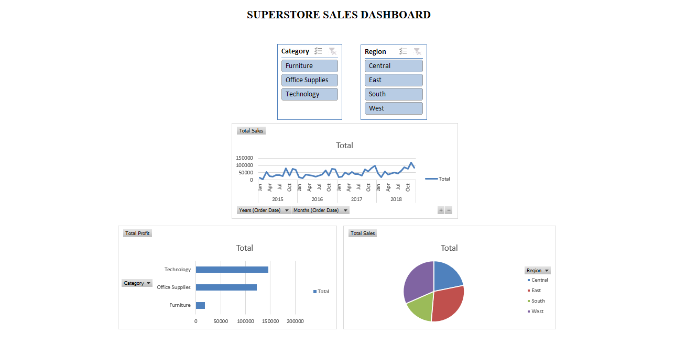
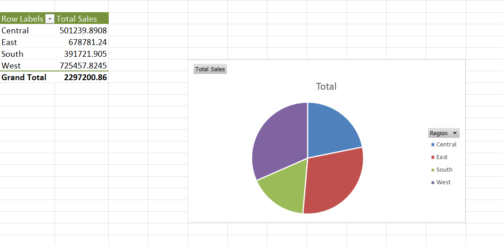
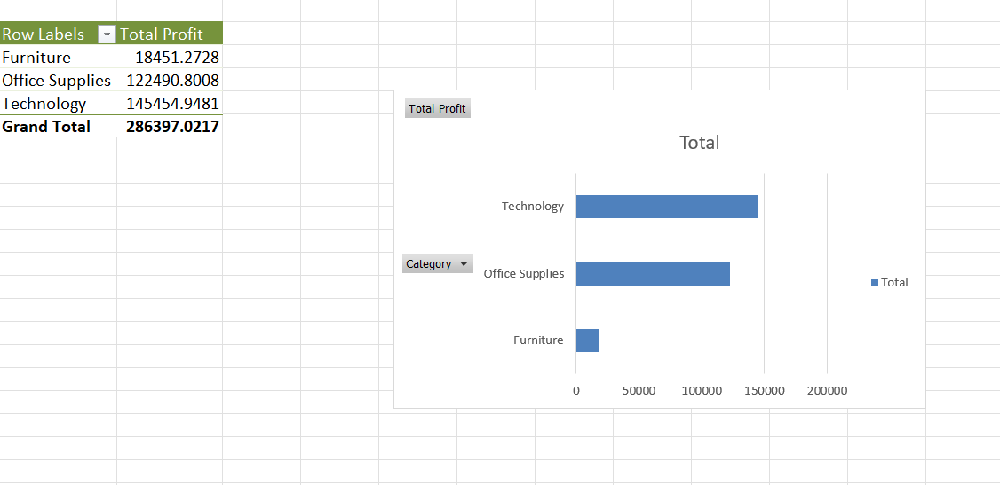
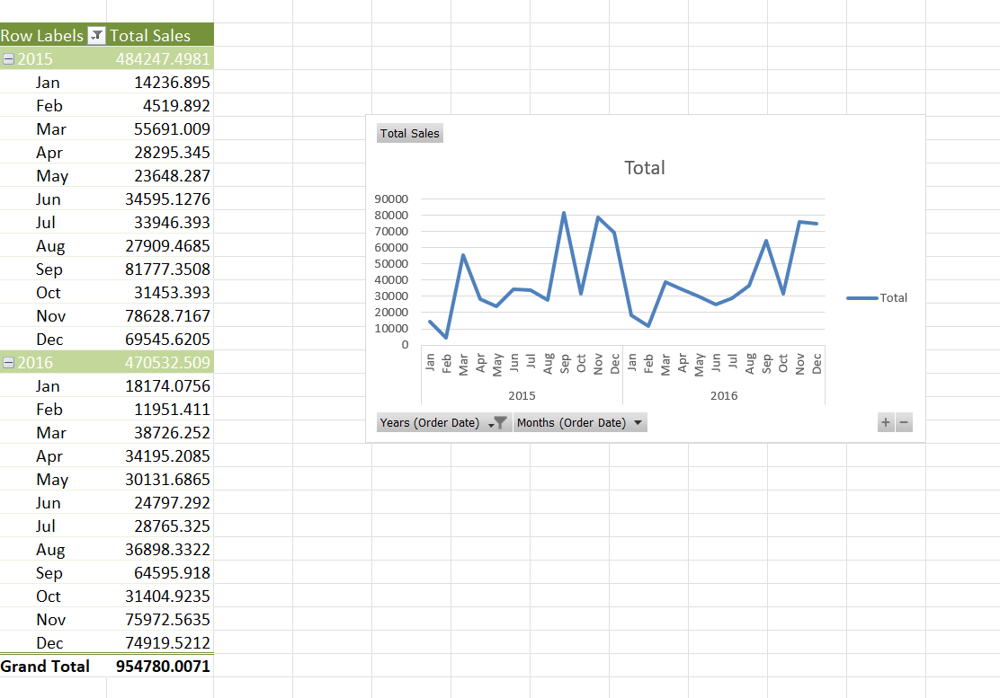

## Superstore Sales Dashboard

This project presents an interactive Sales Dashboard built using Microsoft Excel to analyze and visualize business performance. It enables users to explore sales patterns, profit distribution, and regional performance through structured and insightful visualizations.

---

## Project Overview

Developed an interactive Sales Dashboard using Microsoft Excel as part of a Data Analyst Internship at SkillCraft Technology. The dashboard focuses on evaluating sales performance, profit distribution, and time-based trends to support data-driven decision-making.

---

## Dashboard Preview

---

## Key Visuals

The dashboard includes the following visualizations:

* Sales by Region  
* Profit by Category  
* Monthly Sales Trend  
* Overall Sales and Profit Summary  

---

## Sales by Region

This visualization illustrates the distribution of sales across different regions, helping identify high-performing and underperforming areas for better strategic planning.

---

## Profit by Category

This chart presents the profit generated by each product category, enabling comparison of category performance and identification of key profit drivers.

---

## Sales Trend

This analysis tracks sales performance over time, helping to identify patterns, trends, and potential seasonal variations.

---

## Tools and Techniques Used

* Microsoft Excel  
* Data Cleaning and Preprocessing  
* Data Visualization  
* Pivot Tables  
* Dashboard Design  

---

## Key Insights

* Sales performance shows noticeable variation across regions  
* Certain product categories contribute significantly to overall profit  
* Sales trends indicate fluctuations and possible seasonal patterns  
* Some regions consistently outperform others in terms of sales  

---

## Files Included

* Superstore_Sales_Dashboard.xlsx  
* dashboard.png  

---

## Conclusion

This dashboard provides a clear and interactive approach to analyzing sales and profit performance. It effectively highlights key trends and supports informed decision-making through data visualization.
